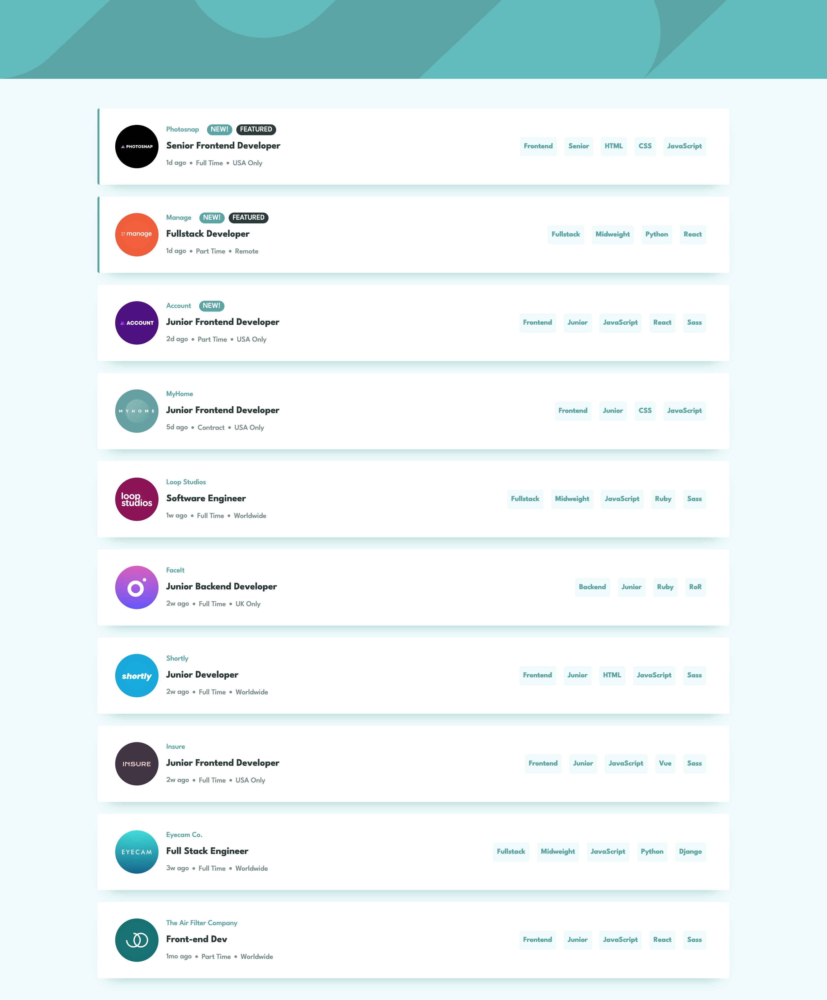

# Frontend Mentor - Job listings with filtering solution

This is a solution to the [Job listings with filtering challenge on Frontend Mentor](https://www.frontendmentor.io/challenges/job-listings-with-filtering-ivstIPCt). Frontend Mentor challenges help you improve your coding skills by building realistic projects.

## Table of contents

- [Overview](#overview)
  - [The challenge](#the-challenge)
  - [Screenshot](#screenshot)
  - [Links](#links)
- [My process](#my-process)
  - [Built with](#built-with)
  - [What I learned](#what-i-learned)
  - [Continued development](#continued-development)
  - [Useful resources](#useful-resources)
- [Author](#author)
- [Acknowledgments](#acknowledgments)

## Overview

### The challenge

Users should be able to:

- View the optimal layout for the site depending on their device's screen size
- See hover states for all interactive elements on the page
- Filter job listings based on the categories

### Screenshot

### Links

- Solution URL: [Add solution URL here](https://github.com/ahmedsaliuGit/static-job-listings
- Live Site URL: [Add live site URL here](https://ahmedsaliugit.github.io/static-job-listings/)

## My process

- Follow the guide in the challenge

### Built with

- Semantic HTML5 markup
- CSS custom properties
- Flexbox
- CSS Grid
- Mobile-first workflow
- [React](https://reactjs.org/) - JS library
- [Vite.js](https://vitejs.org/) - React framework
- [Tailwindcss](https://tailwindcss.com/) - For styles

### What I learned

Learning more features of vite and tailwindcss

### Useful resources

- [Vite build tools](https://www.vite.com) - Install and setup
- [Tailwindcss utilities first](https://www.tailwindcss.com) - Install and setup quickly

## Author

- Website - [Ahmed Saliu](https://github.com/ahmedsaliuGit)
- Frontend Mentor - [@ahmedsaliuGit](https://www.frontendmentor.io/profile/ahmedsaliuGit)

## Acknowledgments

Thanks to @frontendmentor team
